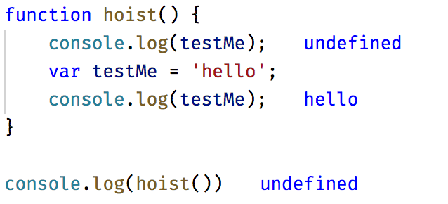

# 블록 바인딩

var를 이용하여 변수를 선언할 때의 문제점

### Quiz 다음 함수 getValue의 결과 값은 무엇일까?

```javascript
function getValue(condition) {
    var value = 'red';
    if (condition) {
        var value = 'blue';
    } else {
        var value = 'orange';
    }

    return value;
}

console.log(getValue(true)); //???
console.log(getValue(false)); //???
```

- 호이스팅 (hoisting) 이란?
    hoisting 뜻: 끌어올리기
    변수 선언문을 최상단으로 실행컨텍스트(함수)의 최상단으로 끌어올리는 것.

```javascript
function hoist() {
    console.log(testMe);
    var testMe = 'hello';
    console.log(testMe);
}

hoist(); //???
```



왜일까요?

실제로 함수를 실행실켰을 경우 어떻게 동작하는지 알아봅시다.
```javascript
function hoist() {
    var testMe;
    console.log(testMe);
    testMe = 'hello';
    console.log(testMe);
}
```

이와같이 함수단위로 변수의 관리와 호이스팅 때문에 여러가지 실수가 일어난다.

## let 선언
변수를 let으로 선언하여 이와 같은 문제를 해결해보자.

```javascript
function getValue(condition) {
    let value = 'red';
    if (condition) {
        let value = 'blue';
    } else {
        let value = 'orange';
    }

    return value;
}

console.log(getValue(true)); //???
console.log(getValue(false)); //???
```

let 선언은 var과 syntax는 같다. 기본적으로 대부분의 var는 let으로 대체 가능하지만 let은 블록 스코프를 가진다.
또한 let 선언은 선언된 블록의 맨 위로 호이스팅 되지 않기 때문에 사용자의 실수를 줄일 수 있다. var 과 크게   다른점은 재선언이 불가능 하다는 것이다.

```javascript
let isEnable = true;
let isEnable = false;
```
## const 선언

기본적으로 let과 같지만 primitive 타입을 재할당 할 수 없다는 점에서 다르다.
한가지 오해하기 쉬운 점 이있는데 객체와 같은 reference 타입은 수정 가능하다. 쉽게 설명하자면 메모리 주소의 변경을 금지 한다.
```javascript
let isEnable = true;
isEnable = false;


const isEnable2 = false;
isEnable2 = true;

const obj = {};
obj.a = 4;
obj = {}
```

## TDZ(Temporal Dead Zone)
- 변수가 블록 스코프의 시작부터 변수가 처음 선언되는 지점까지를 가리키는 표현.
```javascript
if (true) {
    console.log(typeof value);
    let value = 'blue';
}
```

var로 선언했을 경우 위의 코드는 undefine를 log하겠지만 let과 const 선언의 특징인 TDZ에 의해 런타임 에러가 발생한다. 

## Quiz
```javascript
for (var i = 0; i < 10; i++) {
    setTimeout(function() {
        console.log(i); //???
    });
}
```

해결법

- 기존의 해결법 - 함수를 이용 새로운 실행 컨텍스트를 만들어서 해결하는 방법
```javascript
for (var i = 0; i < 10; i++) {
    (function(_i) {
        setTimeout(function() {
            console.log(_i);
        });
    })(i)
}
```

- let, const를 사용하여 해결하는 방법
```javascript
for (let i = 0; i < 10; i++) {
    setTimeout(function() {
        console.log(i); //???
    });
}
```
블록 안에서 let 선언은 반복할 때마다 매번 새 변수 i를 만들고, 반복문 안에서 만들어진 함수는 i의 복사본을 얻을 수 있다. i의 복사본은 그것이 만들어지는 반복실행의 처음에 할당된 값을 가진다.