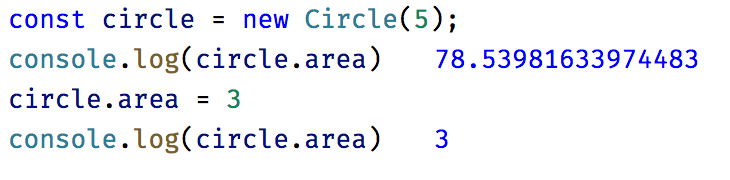
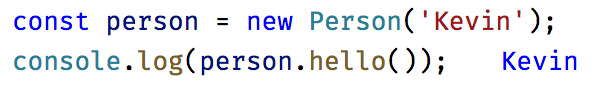
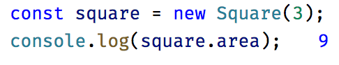

# 클래스

- before
```javascript
function Foo() {
    //...
}
```

- after
```javascript
class Foo {
    //...
}
```

## 기존 함수 선언과 차이점
- 클래스 선언은 호이스팅되지 않는다. 클래스 선언은 let 선언 처럼 동작한다.
- 클래스 선언 내의 모든 코드는 자동으로 strict 모드에서 실행된다.
- 모든 메서다는 열거할 수 없다.
- 내부 매서드에는 [[Construct]]가 없으므로 new와 함께 호출할 경우 에러가 발생한다.
- new 없이 클래스 생성자를 호출하면 에러가 발생한다.

## getter, setter

```javascript
class Circle {
  constructor (radius) {
      this.radius = radius;
  }
  get area () {
      return Math.PI * this.radius * this.radius;
  }
  set area (n) {
      this.radius = Math.sqrt(n / Math.PI);
  }
}
```


## 계산된 멤버 이름
```javascript
const methodName = 'hello';

class Person {
  constructor(name) {
    this.name = name;
  }
  [methodName]() {
    return this.name;
  }
}
```



## static 맴버

```javascript
class Person {
  static getName() {
    return 'Jung';
  }
  constructor(name) {
    this.name = name;
  }
}
```


## 상속
```javascript
class Rectangle {
  constructor(length, width) {
    this.length = length;
    this.width = width;
  }

  get area() {
    return this.length * this.width;
  }
}

class Square extends Rectangle {
  constructor(length) {
    super(length, length);
  }
}
```



### super 키워드가 가리키는 것은?
- super(…) 는 this = new ParentConstructor(…) 의 syntactic sugar 일 뿐이다.