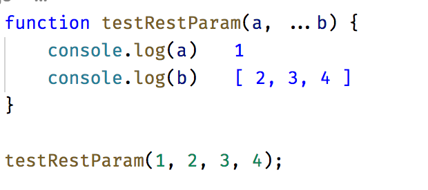

# 함수

## 매개변수 기본값

- before
```javascript
function makeRequest(url, timeout) {
    timeout = timeout || 2000;

    // ...
}
```

- after
```javascript
function makeRequest(url, timeout = 2000) {
    // ...
}
```

## Quiz

```javascript
function makeRequest(timeout = 2000) {
    console.log(timeout) //???
}

makeRequest(null);
```

## 나머지 매개변수
나머지 매개변수는 매개변수 앞에 세개의 점(...)을 붙여서 나타낸다. 이렇게 표현된 매개변수는 함수 안에서 배열이 된다.

```javascript
function testRestParam(a, ...b) {
    console.log(a)
    console.log(b)
}

testRestParam(1, 2, 3, 4);
```

 

## 전개 연산자

나머지 매개변수가 여러 개의 독립적인 인자를 합쳐주는 반면, 전개 연산자는 배열을 나누어 개별인자로 전달한다.

- before
```javascript
var arr1 = [1, 2, 3];
var arr2 = [4, 5];
var arr3 = arr1.concat(arr2).concat(5);
console.log(arr3); //???
```

- after
```javascript
const arr1 = [1, 2, 3];
const arr2 = [4, 5];
const arr3 = [...arr1, ...arr2, 5];
console.log(arr3); //???
```


## 화살표 함수
화살표(=>)를 사용하여 새로운 문법으로 정의 되는 함수.

``` javascript
    const reflect = value => value;

    // 사실상 같은 코드
    const reflect = function(value) {
        return value;
    };
```
기존 함수와 차이
- new 를 사용할 수 없음
- this 를 변경할 수 없음 (기존 함수와 달리 runtime에서 this가 정해지지 않고, 선언시 this가 정해진다.)

this바인딩은 자바스크립트에서 에러의 주요 원인이기 때문에 이와같은 특징을 가진다. 이외의 차이점들도 기존 함수의 모호함을과 에러를 줄이는데 초첨을 맞추고 그로인해 자바스크립트 엔진이 화살표 함수 실행을 더욱 최적화 할 수 있게 되었다.

``` javascript
    let PageHandler = {
        init: function() {
            document.addEventListener('click', function(event) {
                this.doSomething(); // error 발생
            });
        },
        doSomething: function() {
            console.log('what do you want?');
        }
    }
```

init 함수의 event callback function은 PageHandler에 바인딩 되지 않고 이벤트의 대상이 되는 객체를 참조하기 때문에 생각대로 동작하지 않는다. 이를 해결하기 방법은 아래와 같다.

 - before 
``` javascript
    let PageHandler = {
        init: function() {
            document.addEventListener('click', (function(event) {
                this.doSomething();
            }).bind(this));
        },
        doSomething: function() {
            console.log('what do you want?');
        }
    }
```
bind(this)를 이용하여 강제로 this를 전달하는 방법

- after
``` javascript
    let PageHandler = {
        init: function() {
            document.addEventListener('click', event => this.doSomething());
        },
        doSomething: function() {
            console.log('what do you want?');
        }
    }
```


## "this"는 어떻게 결정되는가?

1. 호출자가 무엇인가에 의해 결정되는 경우

- 함수를 호출 할 때

``` javascript
var myFunction = function() {
   console.log(this);
}

myFunction();    // Window 

```

``` javascript
function foo(){
	console.log(this.a);
}

var obj = {
	a:2,
	foo:foo
};

obj.foo();  // 2 
```

- call, apply, bind로 강제로 결정되는 경우
```javascript
var a = 'a';
var b = 'b';
function greet(a, b) {
	console.log(this.name);
    console.log(a, b);
}

var person = {
	name:'Alex'
}

greet.apply(person, [a, b]);

greet.call(person, a);

var _greet = greet.bind(person);
_greet(a, b);
_greet(a, c);
_greet(a, d);
```

